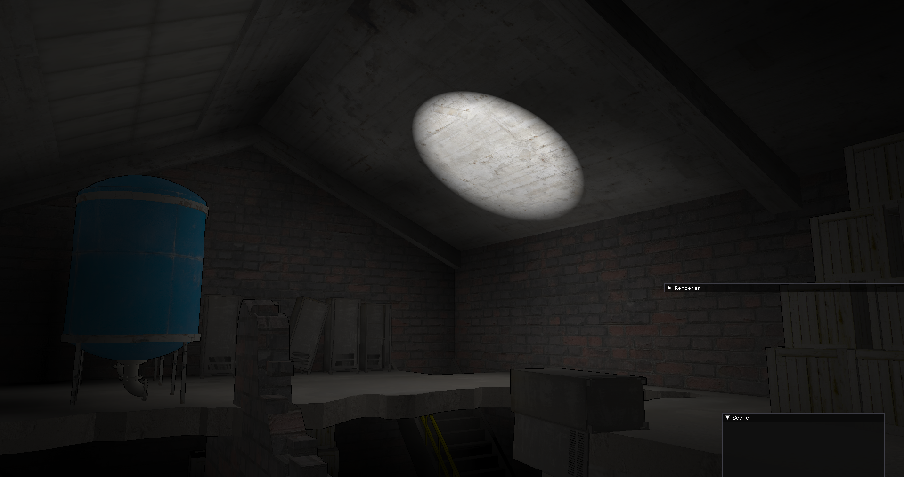

# An implementation of Real-Time Diffuse Global Illumination using Radiance Caching

This thesis presents an implementation of real-time diffuse global illumination using radiance caching, with an optimized cache population scheme. Specifically, we implement the paper [Real-Time Diffuse Global Illumination Using Radiance Hints](http://graphics.cs.aueb.gr/graphics/docs/papers/RadianceHintsPreprint.pdf) and used a approach that generates cache points only at locations that are guaranteed to contribute to the reconstructed surface irradiance from the paper [Real-time Radiance Caching usingChrominance Compression](https://jcgt.org/published/0003/04/06/). This optimization reduces the number of cache points generated and improves the overall performance of the technique.

# Images

**0 bounces**

**1 bounces**

**2 bounces**

**3 bounces**

# Libraries used

- glad
- glfw
- glm
- stb_image
- assimp